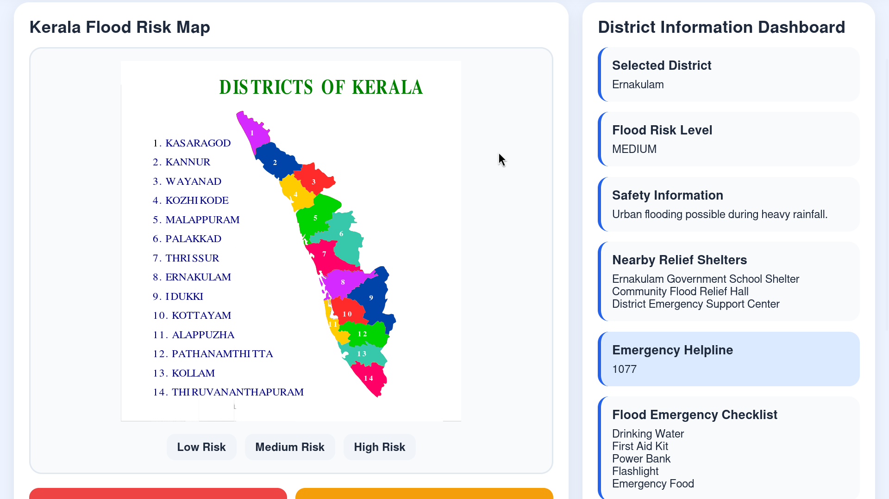

# Kerala Flood Safe Interactive Map

## Overview

Kerala experiences seasonal flooding that affects communities, transport systems, and public safety. This project explores how an interactive mapping system can improve disaster preparedness by helping users quickly access flood risk information, nearby relief shelters, emergency contacts, and preparedness guidance.

The project is designed as an easy-to-use disaster awareness dashboard for improving public preparedness during flood emergencies.

## Features

- Interactive Kerala district selection
- District-based flood risk information
- Nearby relief shelter information
- Emergency preparedness guide
- Kerala emergency helpline numbers
- Flood emergency checklist
- Simple disaster awareness dashboard

## How It Works

1. Select a district from Kerala.
2. View the flood risk level.
3. Check nearby relief shelters.
4. Read preparedness information.
5. Access emergency contact numbers.
6. Follow flood safety guidance.

## Technologies Used

- HTML
- CSS
- JavaScript
- GitHub Pages

## Purpose of the Project

Floods are one of the most common natural disasters affecting Kerala. During emergencies, access to clear information becomes important for preparedness and safety.

This project demonstrates how interactive mapping concepts can help improve awareness by presenting flood-related information in a simple and accessible way.

## Future Improvements

- Clickable districts directly on the map
- Real-time rainfall and weather integration
- Live flood alerts
- GIS-based flood zone visualization
- Real shelter database integration

## Screenshot

Dashboard Preview:

## Author

Created by Visal Vijay
